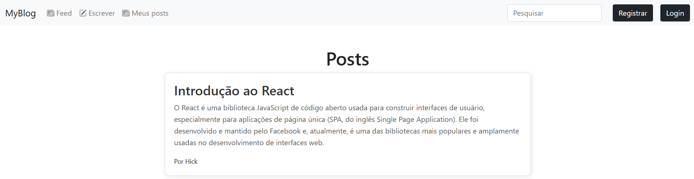
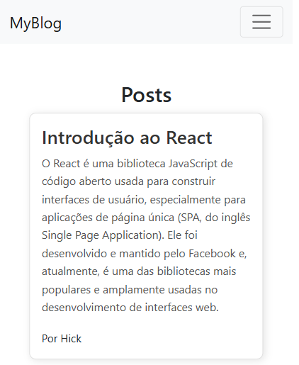

# MyBlog - React

## Sobre o projeto

O projeto **MyBlog**  é um mini blog, onde os usuários podem se cadastrar, criar, editar e excluirem seus posts. Para a criação dos posts, basta informar o seu título e seu conteúdo!

## Layout do blog

### Web


### Celular


## Funcionalidades

- cadastrar usuários
- excluir usuários
- cadastrar posts
- editar posts
- excluir posts

## Tecnologias utilizadas

- `React JS` para o frontend
- `Node + Express` para o backend
- `SQLite3` para o banco de dados

## Instalação

Segue os passos para a instalação:
- **Instalar as dependências do backend e do frontend**
	- backend:
	```
		cd backend && npm install
	```
	- blog:
	```
		cd blog && npm install
	```


## Variáveis de ambiente

Nas pastas `backend/` e `blog/`, criar um arquivo `.env`
 - `backend/.env`:
	 - `COOKIE_SECRET`: chave secreta para o middleware `express-session`
	 - `DB_SOURCE`: caminho do banco de dados
	 -  `HOST`: endereço do servidor, sem o http/https (192.168.3.x)
	 - `NODE_ENV`: ambiente de desenvolvimento ou produção(development || production)
	 - `PORT`: porta do servidor

- `blog/.env`:
	 - `VITE_API_URL`: host do servidor, no formato `[endereço]:[porta]	`
	 

## Executar o projeto

Nas pastas `backend/` e `blog/`, digite:
```
npm run dev
```

## Aplicação

Link: [https://github.com/](https://github.com/) - *Ainda não disponível*

## Autor
Henrique Palermo Emerick